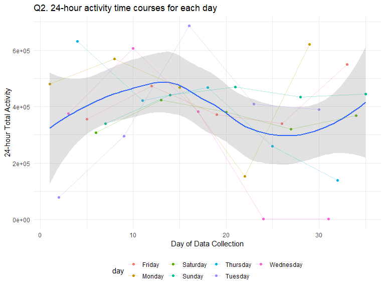
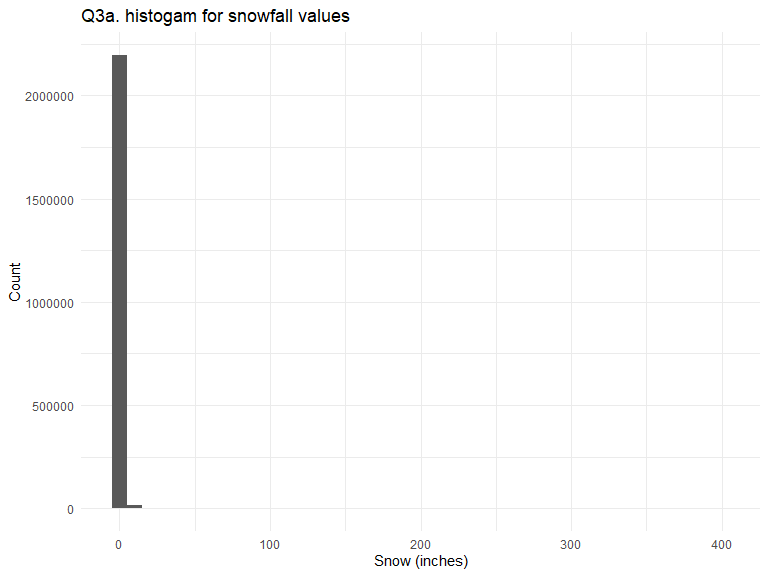
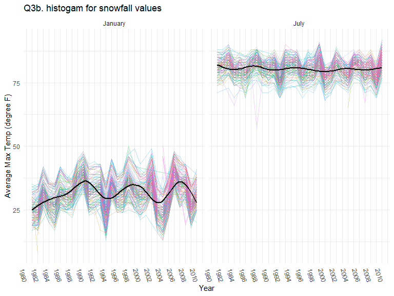
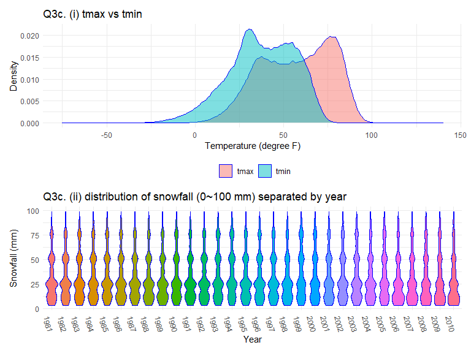

Homework 3 zz2901
================
Troy Zhou

## Problem 1

#### Read in the data

``` r
data("instacart")

instacart = 
  instacart %>% 
  as_tibble(instacart)
```

#### Answer questions about the data

This dataset contains 1384617 rows and 15 columns, with each row
resprenting a single product from an instacart order. Variables include
identifiers for user, order, and product; the order in which each
product was added to the cart. There are several order-level variables,
describing the day and time of the order, and number of days since prior
order. Then there are several item-specific variables, describing the
product name (e.g. Yogurt, Avocado), department (e.g. dairy and eggs,
produce), and aisle (e.g. yogurt, fresh fruits), and whether the item
has been ordered by this user in the past. In total, there are 39123
products found in 131209 orders from 131209 distinct users.

Below is a table summarizing the number of items ordered from aisle. In
total, there are 134 aisles, with fresh vegetables and fresh fruits
holding the most items ordered by far.

``` r
instacart %>% 
  count(aisle) %>% 
  arrange(desc(n))
```

    ## # A tibble: 134 × 2
    ##   aisle                           n
    ##   <chr>                       <int>
    ## 1 fresh vegetables           150609
    ## 2 fresh fruits               150473
    ## 3 packaged vegetables fruits  78493
    ## 4 yogurt                      55240
    ## 5 packaged cheese             41699
    ## # … with 129 more rows
    ## # ℹ Use `print(n = ...)` to see more rows

Next is a plot that shows the number of items ordered in each aisle.
Here, aisles are ordered by ascending number of items.

``` r
instacart %>% 
  count(aisle) %>% 
  filter(n > 10000) %>% 
  mutate(aisle = fct_reorder(aisle, n)) %>% 
  ggplot(aes(x = aisle, y = n)) + 
  geom_point() + 
  labs(title = "Number of items ordered in each aisle") +
  theme(axis.text.x = element_text(angle = 60, hjust = 1))
```


Our next table shows the three most popular items in aisles
`baking ingredients`, `dog food care`, and `packaged vegetables fruits`,
and includes the number of times each item is ordered in your table.

``` r
instacart %>% 
  filter(aisle %in% c("baking ingredients", "dog food care", "packaged vegetables fruits")) %>%
  group_by(aisle) %>% 
  count(product_name) %>% 
  mutate(rank = min_rank(desc(n))) %>% 
  filter(rank < 4) %>% 
  arrange(desc(n)) %>%
  knitr::kable()
```

| aisle                      | product_name                                  |    n | rank |
|:---------------------------|:----------------------------------------------|-----:|-----:|
| packaged vegetables fruits | Organic Baby Spinach                          | 9784 |    1 |
| packaged vegetables fruits | Organic Raspberries                           | 5546 |    2 |
| packaged vegetables fruits | Organic Blueberries                           | 4966 |    3 |
| baking ingredients         | Light Brown Sugar                             |  499 |    1 |
| baking ingredients         | Pure Baking Soda                              |  387 |    2 |
| baking ingredients         | Cane Sugar                                    |  336 |    3 |
| dog food care              | Snack Sticks Chicken & Rice Recipe Dog Treats |   30 |    1 |
| dog food care              | Organix Chicken & Brown Rice Recipe           |   28 |    2 |
| dog food care              | Small Dog Biscuits                            |   26 |    3 |

Finally is a table showing the mean hour of the day at which Pink Lady
Apples and Coffee Ice Cream are ordered on each day of the week. This
table has been formatted in an untidy manner for human readers. Pink
Lady Apples are generally purchased slightly earlier in the day than
Coffee Ice Cream, with the exception of day 5.

``` r
instacart %>%
  filter(product_name %in% c("Pink Lady Apples", "Coffee Ice Cream")) %>%
  group_by(product_name, order_dow) %>%
  summarize(mean_hour = mean(order_hour_of_day)) %>%
  spread(key = order_dow, value = mean_hour) %>%
  knitr::kable(digits = 2)
```

    ## `summarise()` has grouped output by 'product_name'. You can override using the
    ## `.groups` argument.

| product_name     |     0 |     1 |     2 |     3 |     4 |     5 |     6 |
|:-----------------|------:|------:|------:|------:|------:|------:|------:|
| Coffee Ice Cream | 13.77 | 14.32 | 15.38 | 15.32 | 15.22 | 12.26 | 13.83 |
| Pink Lady Apples | 13.44 | 11.36 | 11.70 | 14.25 | 11.55 | 12.78 | 11.94 |

## Problem 2

Accelerometers have become an appealing alternative to self-report
techniques for studying physical activity in observational studies and
clinical trials, largely because of their relative objectivity. During
observation periods, the devices measure “activity counts” in a short
period; one-minute intervals are common. Because accelerometers can be
worn comfortably and unobtrusively, they produce around-the-clock
observations.

This problem uses five weeks of accelerometer data collected on a 63
year-old male with BMI 25, who was admitted to the Advanced Cardiac Care
Center of Columbia University Medical Center and diagnosed with
congestive heart failure (CHF). The data can be downloaded here. **In
this spreadsheet, variables `activity.*` are the activity counts for
each minute of a 24-hour day starting at midnight.**

#### Load, tidy, and otherwise wrangle the data. Your final dataset should include all originally observed variables and values; have useful variable names; include a weekday vs weekend variable; and encode data with reasonable variable classes. Describe the resulting dataset (e.g. what variables exist, how many observations, etc).

``` r
accel_data <- read.csv("data/accel_data.csv") %>% 
  janitor::clean_names() %>% 
  mutate(real_day_id=day_id-(week-1)*7,
    day = recode(real_day_id,`1`="Monday",`2`="Tuesday",`3`="Wednesday",
                 `4`="Thursday",`5`="Friday",`6`="Saturday",`7`="Sunday"),
        weekday_vs_weekend = if_else(day=="Saturday"|day=="Sunday",1,2,missing=99),
         weekday_vs_weekend = recode(weekday_vs_weekend,`1`="Weekend",`2`="Weekday")) %>% 
  select(1,2,3,weekday_vs_weekend,everything(),-real_day_id)

accel_data[1:5,1:5]
```

    ##   week day_id       day weekday_vs_weekend activity_1
    ## 1    1      1    Monday            Weekday   88.37778
    ## 2    1      2   Tuesday            Weekday    1.00000
    ## 3    1      3 Wednesday            Weekday    1.00000
    ## 4    1      4  Thursday            Weekday    1.00000
    ## 5    1      5    Friday            Weekday   47.35556

<span style="color:#36648B;font-weight:700">

- Description of `accel_data`

  - `accel_data` was imported from the `csv` file `accel_data.csv` with
    a dimension of `35` observations and `1443` variables. After adding
    the `weekday_vs_weekend` variable, there are `1444` variables.

  - the `day` variable might have been labeled wrongly. It was corrected
    based on `day_id`.

  - `chr` variables `day` and `weekday_vs_weekend`, and `num` variables
    `week`, `day_id`, and `activity_*` are present in the dataset after
    tidying.

</span>

#### Traditional analyses of accelerometer data focus on the total activity over the day. Using your tidied dataset, aggregate across minutes to create a total activity variable for each day, and create a table showing these totals. Are any trends apparent?

``` r
accel_aggregate <- accel_data %>% 
  pivot_longer(5:ncol(accel_data),values_to = "total_activity") %>% 
  group_by(day_id) %>% 
  mutate(total_activity=sum(total_activity)) %>% 
  distinct(day_id,.keep_all=TRUE) %>% 
  select(everything(),-name)

table_prob1 <- accel_aggregate%>% 
  knitr::kable(digits = 3)
```

<span style="color:#36648B;font-weight:700">

- This table shows the aggregated `activity.*` for each `day`.

  - Table:

| week | day_id | day       | weekday_vs_weekend | total_activity |
|-----:|-------:|:----------|:-------------------|---------------:|
|    1 |      1 | Monday    | Weekday            |      480542.62 |
|    1 |      2 | Tuesday   | Weekday            |       78828.07 |
|    1 |      3 | Wednesday | Weekday            |      376254.00 |
|    1 |      4 | Thursday  | Weekday            |      631105.00 |
|    1 |      5 | Friday    | Weekday            |      355923.64 |
|    1 |      6 | Saturday  | Weekend            |      307094.24 |
|    1 |      7 | Sunday    | Weekend            |      340115.01 |
|    2 |      8 | Monday    | Weekday            |      568839.00 |
|    2 |      9 | Tuesday   | Weekday            |      295431.00 |
|    2 |     10 | Wednesday | Weekday            |      607175.00 |
|    2 |     11 | Thursday  | Weekday            |      422018.00 |
|    2 |     12 | Friday    | Weekday            |      474048.00 |
|    2 |     13 | Saturday  | Weekend            |      423245.00 |
|    2 |     14 | Sunday    | Weekend            |      440962.00 |
|    3 |     15 | Monday    | Weekday            |      467420.00 |
|    3 |     16 | Tuesday   | Weekday            |      685910.00 |
|    3 |     17 | Wednesday | Weekday            |      382928.00 |
|    3 |     18 | Thursday  | Weekday            |      467052.00 |
|    3 |     19 | Friday    | Weekday            |      371230.00 |
|    3 |     20 | Saturday  | Weekend            |      381507.00 |
|    3 |     21 | Sunday    | Weekend            |      468869.00 |
|    4 |     22 | Monday    | Weekday            |      154049.00 |
|    4 |     23 | Tuesday   | Weekday            |      409450.00 |
|    4 |     24 | Wednesday | Weekday            |        1440.00 |
|    4 |     25 | Thursday  | Weekday            |      260617.00 |
|    4 |     26 | Friday    | Weekday            |      340291.00 |
|    4 |     27 | Saturday  | Weekend            |      319568.00 |
|    4 |     28 | Sunday    | Weekend            |      434460.00 |
|    5 |     29 | Monday    | Weekday            |      620860.00 |
|    5 |     30 | Tuesday   | Weekday            |      389080.00 |
|    5 |     31 | Wednesday | Weekday            |        1440.00 |
|    5 |     32 | Thursday  | Weekday            |      138421.00 |
|    5 |     33 | Friday    | Weekday            |      549658.00 |
|    5 |     34 | Saturday  | Weekend            |      367824.00 |
|    5 |     35 | Sunday    | Weekend            |      445366.00 |

The trends are really hard to see from a table. But we do notice there
was almost always one day a week that he had significantly lower total
activity compared to the rest of the week.

</span>

#### Accelerometer data allows the inspection activity over the course of the day. Make a single-panel plot that shows the 24-hour activity time courses for each day and use color to indicate day of the week. Describe in words any patterns or conclusions you can make based on this graph.

``` r
accel_aggregate %>%
  ggplot(aes(x = day_id, y = total_activity)) + 
    geom_point(aes( color = day)) + geom_smooth(alpha=0.3)+
    geom_line(aes(color=day),alpha=.3)+
    theme(legend.position = "bottom")+
    labs(
    title = "Q2. 24-hour activity time courses for each day",
    x = "Day of Data Collection",
    y = "24-hour Total Activity")
```

    ## `geom_smooth()` using method = 'loess' and formula 'y ~ x'



<span style="color:#36648B;font-weight:700">

- description and conclusion:

  - From the scatterplot and trend lind created by `geom_point()` and
    `geom_smooth()`, we can observe that the subject’s total activity
    fluctuates greatly throughout the 35 days and also days fo each
    week. He seems to have a period with higher activity after one with
    lower activity and vice versa from the graph. The trends of activity
    for day of the week follow the general trends as shown by the lines
    created from `geom_line()`.

</span>

## Problem 3

#### The goal is to do some exploration of this dataset. To that end, write a short description of the dataset, noting the size and structure of the data, describing some key variables, and indicating the extent to which missing data is an issue.

``` r
str(ny_noaa)
```

    ## tibble [2,595,176 × 7] (S3: tbl_df/tbl/data.frame)
    ##  $ id  : chr [1:2595176] "US1NYAB0001" "US1NYAB0001" "US1NYAB0001" "US1NYAB0001" ...
    ##  $ date: Date[1:2595176], format: "2007-11-01" "2007-11-02" ...
    ##  $ prcp: int [1:2595176] NA NA NA NA NA NA NA NA NA NA ...
    ##  $ snow: int [1:2595176] NA NA NA NA NA NA NA NA NA NA ...
    ##  $ snwd: int [1:2595176] NA NA NA NA NA NA NA NA NA NA ...
    ##  $ tmax: chr [1:2595176] NA NA NA NA ...
    ##  $ tmin: chr [1:2595176] NA NA NA NA ...
    ##  - attr(*, "spec")=
    ##   .. cols(
    ##   ..   id = col_character(),
    ##   ..   date = col_date(format = ""),
    ##   ..   prcp = col_integer(),
    ##   ..   snow = col_integer(),
    ##   ..   snwd = col_integer(),
    ##   ..   tmax = col_character(),
    ##   ..   tmin = col_character()
    ##   .. )

<span style="color:#36648B;font-weight:700">

- The `ny_noaa` has `2595176` observations and `7` variables. The
  variables are `id`, `date`, `prcp`, `snow`, `snwd`, `tmax`, and
  `tmin`, and variable types `chr`, `date`, `int`, `int`, `chr`, and
  `chr` correspondingly.

  - Since `tmax` and `tmin` are clearly numeric measures but in `chr`
    format, we need to change that in cleaning.

- We noticed that there are many missing data for the last five numeric
  measures.

  - `prcp`: 145838 missing obs.

  - `snow`: 381221 missing obs.

  - `snwd`: 591786 missing obs.

  - `tmax`: 1134358 missing obs.

  - `tmin`: 1134420 missing obs.

  - And many of the missing observations overlap.

</span>

**Then, do or answer the following (commenting on the results of
each):**

#### Do some data cleaning. Create separate variables for year, month, and day. Ensure observations for temperature, precipitation, and snowfall are given in reasonable units. For snowfall, what are the most commonly observed values? Why?

``` r
noaa_clean <- ny_noaa %>% 
  separate(date,sep="-",into=c("year","month","day")) %>% 
  mutate(
        year=as.numeric(year),month=as.numeric(month),day=as.numeric(day),
        prcp = as.integer(round(prcp*.1*0.03937008)),
        snow = as.integer(round(snow*0.03937008)),
        snwd = as.integer(round(snwd*0.03937008)),
        tmax = as.integer(round(as.numeric(tmax)*.1*1.8+32)),
        tmin = as.integer(round(as.numeric(tmin)*.1*1.8+32))
         )
str(noaa_clean)
```

    ## tibble [2,595,176 × 9] (S3: tbl_df/tbl/data.frame)
    ##  $ id   : chr [1:2595176] "US1NYAB0001" "US1NYAB0001" "US1NYAB0001" "US1NYAB0001" ...
    ##  $ year : num [1:2595176] 2007 2007 2007 2007 2007 ...
    ##  $ month: num [1:2595176] 11 11 11 11 11 11 11 11 11 11 ...
    ##  $ day  : num [1:2595176] 1 2 3 4 5 6 7 8 9 10 ...
    ##  $ prcp : int [1:2595176] NA NA NA NA NA NA NA NA NA NA ...
    ##  $ snow : int [1:2595176] NA NA NA NA NA NA NA NA NA NA ...
    ##  $ snwd : int [1:2595176] NA NA NA NA NA NA NA NA NA NA ...
    ##  $ tmax : int [1:2595176] NA NA NA NA NA NA NA NA NA NA ...
    ##  $ tmin : int [1:2595176] NA NA NA NA NA NA NA NA NA NA ...

``` r
snowfall_hist <- noaa_clean %>%
  ggplot(aes(x = snow)) + 
    geom_histogram(binwidth=10,na.rm=TRUE)+
    labs(
    title = "Q3a. histogam for snowfall values",
    x = "Snow (inches)",
    y = "Count")
snowfall_hist
```



<span style="color:#36648B;font-weight:700">

- The `ny_noaa` data has `date` variable split into `year`, `month`, and
  `day`.

- The original unit for temperature measurements was
  `tenth of degrees C`, and it was changed to `degrees F` after
  cleaning.

- The original unit for precipitation measurements was `tenth of mm`,
  and it was changed to `inches` after cleaning.

- The original unit for snowfall and snow depth measurements was `mm`,
  and it was changed to `inches` after cleaning.

- The most common values are in range `0~10` inches.

- From the above histogram plotting all `snow` values in inches with
  `binwidth = 10`, we can see that almost all observations fall between
  `0 - 10` range with lowest measure at `-1` inches and highest at
  `400`.

</span>

#### Make a two-panel plot showing the average max temperature in January and in July in each station across years. Is there any observable / interpretable structure? Any outliers?

``` r
noaa_avg <- noaa_clean %>% 
  filter((month == 01 | month==07) & !is.na(tmax)) %>% 
  group_by(id,year,month) %>% 
  summarise(avg_tmax=mean(tmax),.groups = "keep") %>% 
  mutate(month=recode(month,`1`="January",`7`="July"),
         avg_tmax=round(avg_tmax))

  
  ggplot(data=noaa_avg) +
    geom_line(aes(x=year,y=avg_tmax,color=id),show.legend = FALSE,alpha=.3)+
    geom_smooth(aes(x=year,y=avg_tmax),color="black",show.legend = FALSE)+
    facet_grid(~month)+
    labs(
    title = "Q3b. histogam for snowfall values",
    x = "Year",
    y = "Average Max Temp (degree F)")+ scale_x_continuous(n.breaks = 15)+theme(axis.text.x = element_text(angle = -75))
```

    ## `geom_smooth()` using method = 'gam' and formula 'y ~ s(x, bs = "cs")'



<span style="color:#36648B;font-weight:700">

- The above two-panel graph `Q3b. histogam for snowfall values` shows
  the average max temperature in January and in July in each station
  across years.

  - The colored lines represent each station’s average max temperature
    across the years. The legend was removed due to low readability.

  - The average max temperatures in each station across the years
    fluctuate much more than that in July as we can observe from the
    graph. July’s average max temperatures are also much higher than
    January’s, which is expected. And there appears to be a trends of
    increasing average max temperature in January from 1980 to 1990, but
    stays somehow stable in later years.

  - For January 1982, 1994, and 2004, we observe drastic drop of average
    maximum temperatures in all station. Following that, there were
    always drastic increase in average temperatures in the following
    years.

  - In January 1982 and July 1988 we can observe two outliers with much
    lower average temperatures.

</span>

#### Make a two-panel plot showing (i) tmax vs tmin for the full dataset (note that a scatterplot may not be the best option); and (ii) make a plot showing the distribution of snowfall values greater than 0 and less than 100 separately by year.

``` r
 t_vs <- noaa_clean %>% pivot_longer(cols=c("tmax","tmin"),names_to = "tcat",values_to = "temp") %>% 
  ggplot(aes(x = temp)) +
  geom_density(aes(fill = tcat), color = "blue", alpha = .5,na.rm = TRUE)+
    labs(fill='',
    title = "Q3c. (i) tmax vs tmin",
    x = "Temperature (degree F)",
    y = "Density")

  snow_year <- 
    ny_noaa %>% select(id,date,snow) %>% 
    filter(snow>0 & snow<100) %>% 
    separate(date,sep="-",into=c("year","month","day")) %>% 
    mutate(
        year=as.factor(year),month=as.numeric(month),day=as.numeric(day)
         ) %>% 
    ggplot(aes(x=year,y=snow))+
    geom_violin(aes(fill=year),color="blue",show.legend = FALSE)+theme(axis.text.x = element_text(angle = -75)) +
      labs(
    title = "Q3c. (ii) distribution of snowfall (0~100 mm) separated by year",
    x = "Year",
    y = "Snowfall (mm)")
  
  t_vs/snow_year
```


