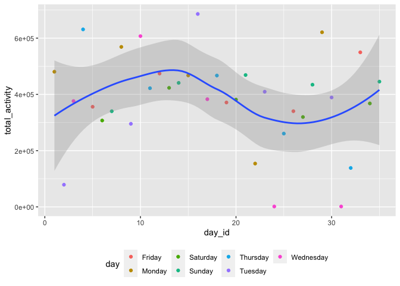

Homework 3 zz2901
================
Troy Zhou

## Problem 2

Accelerometers have become an appealing alternative to self-report
techniques for studying physical activity in observational studies and
clinical trials, largely because of their relative objectivity. During
observation periods, the devices measure “activity counts” in a short
period; one-minute intervals are common. Because accelerometers can be
worn comfortably and unobtrusively, they produce around-the-clock
observations.

This problem uses five weeks of accelerometer data collected on a 63
year-old male with BMI 25, who was admitted to the Advanced Cardiac Care
Center of Columbia University Medical Center and diagnosed with
congestive heart failure (CHF). The data can be downloaded here. **In
this spreadsheet, variables `activity.*` are the activity counts for
each minute of a 24-hour day starting at midnight.**

-   Load, tidy, and otherwise wrangle the data. Your final dataset
    should include all originally observed variables and values; have
    useful variable names; include a weekday vs weekend variable; and
    encode data with reasonable variable classes. Describe the resulting
    dataset (e.g. what variables exist, how many observations, etc).

``` r
accel_data <- read.csv("data/accel_data.csv") %>% 
  janitor::clean_names() %>% 
  mutate(real_day_id=day_id-(week-1)*7,
    day = recode(real_day_id,`1`="Monday",`2`="Tuesday",`3`="Wednesday",
                 `4`="Thursday",`5`="Friday",`6`="Saturday",`7`="Sunday"),
        weekday_vs_weekend = if_else(day=="Saturday"|day=="Sunday",1,2,missing=99),
         weekday_vs_weekend = recode(weekday_vs_weekend,`1`="Weekend",`2`="Weekday")) %>% 
  select(1,2,3,weekday_vs_weekend,everything(),-real_day_id)

accel_data[1:5,1:5]
```

    ##   week day_id       day weekday_vs_weekend activity_1
    ## 1    1      1    Monday            Weekday   88.37778
    ## 2    1      2   Tuesday            Weekday    1.00000
    ## 3    1      3 Wednesday            Weekday    1.00000
    ## 4    1      4  Thursday            Weekday    1.00000
    ## 5    1      5    Friday            Weekday   47.35556

<span style="color:#36648B;font-weight:700">

-   Description of `accel_data`

    -   `accel_data` was imported from the `csv` file `accel_data.csv`
        with a dimension of `35` observations and `1443` variables.
        After adding the `weekday_vs_weekend` variable, there are `1444`
        variables.

    -   the `day` variable might have been labeled wrongly. It was
        corrected based on `day_id`.

    -   `chr` variables `day` and `weekday_vs_weekend`, and `num`
        variables `week`, `day_id`, and `activity_*` are present in the
        dataset after tidying.

</span>

-   Traditional analyses of accelerometer data focus on the total
    activity over the day. Using your tidied dataset, aggregate across
    minutes to create a total activity variable for each day, and create
    a table showing these totals. Are any trends apparent?

``` r
accel_aggregate <- accel_data %>% 
  pivot_longer(5:ncol(accel_data),values_to = "total_activity") %>% 
  group_by(day_id) %>% 
  mutate(total_activity=sum(total_activity)) %>% 
  distinct(day_id,.keep_all=TRUE) %>% 
  select(everything(),-name)

table_prob1 <- accel_aggregate%>% 
  knitr::kable(digits = 3)
```

<span style="color:#36648B;font-weight:700">

-   This table shows the aggregated `activity.*` for each `day`.

    -   Table:

| week | day_id | day       | weekday_vs_weekend | total_activity |
|-----:|-------:|:----------|:-------------------|---------------:|
|    1 |      1 | Monday    | Weekday            |      480542.62 |
|    1 |      2 | Tuesday   | Weekday            |       78828.07 |
|    1 |      3 | Wednesday | Weekday            |      376254.00 |
|    1 |      4 | Thursday  | Weekday            |      631105.00 |
|    1 |      5 | Friday    | Weekday            |      355923.64 |
|    1 |      6 | Saturday  | Weekend            |      307094.24 |
|    1 |      7 | Sunday    | Weekend            |      340115.01 |
|    2 |      8 | Monday    | Weekday            |      568839.00 |
|    2 |      9 | Tuesday   | Weekday            |      295431.00 |
|    2 |     10 | Wednesday | Weekday            |      607175.00 |
|    2 |     11 | Thursday  | Weekday            |      422018.00 |
|    2 |     12 | Friday    | Weekday            |      474048.00 |
|    2 |     13 | Saturday  | Weekend            |      423245.00 |
|    2 |     14 | Sunday    | Weekend            |      440962.00 |
|    3 |     15 | Monday    | Weekday            |      467420.00 |
|    3 |     16 | Tuesday   | Weekday            |      685910.00 |
|    3 |     17 | Wednesday | Weekday            |      382928.00 |
|    3 |     18 | Thursday  | Weekday            |      467052.00 |
|    3 |     19 | Friday    | Weekday            |      371230.00 |
|    3 |     20 | Saturday  | Weekend            |      381507.00 |
|    3 |     21 | Sunday    | Weekend            |      468869.00 |
|    4 |     22 | Monday    | Weekday            |      154049.00 |
|    4 |     23 | Tuesday   | Weekday            |      409450.00 |
|    4 |     24 | Wednesday | Weekday            |        1440.00 |
|    4 |     25 | Thursday  | Weekday            |      260617.00 |
|    4 |     26 | Friday    | Weekday            |      340291.00 |
|    4 |     27 | Saturday  | Weekend            |      319568.00 |
|    4 |     28 | Sunday    | Weekend            |      434460.00 |
|    5 |     29 | Monday    | Weekday            |      620860.00 |
|    5 |     30 | Tuesday   | Weekday            |      389080.00 |
|    5 |     31 | Wednesday | Weekday            |        1440.00 |
|    5 |     32 | Thursday  | Weekday            |      138421.00 |
|    5 |     33 | Friday    | Weekday            |      549658.00 |
|    5 |     34 | Saturday  | Weekend            |      367824.00 |
|    5 |     35 | Sunday    | Weekend            |      445366.00 |

The trends are really hard to see from a table. But we do notice there
was almost always one day a week that he had significantly lower total
activity compared to the rest of the week.

</span>

-   Accelerometer data allows the inspection activity over the course of
    the day. Make a single-panel plot that shows the 24-hour activity
    time courses for each day and use color to indicate day of the week.
    Describe in words any patterns or conclusions you can make based on
    this graph.

``` r
accel_aggregate %>%
  ggplot(aes(x = day_id, y = total_activity)) + 
    geom_point(aes( color = day)) + geom_smooth(alpha=0.3)+
    theme(legend.position = "bottom")
```

    ## `geom_smooth()` using method = 'loess' and formula 'y ~ x'

<!-- -->

<span style="color:#36648B;font-weight:700">

-   description and conclusion:

    -   From the scatterplot and trend lind created by `geom_point()`
        and `geom_smooth()`, we can observe that the subject’s total
        activity fluctuates greatly throughout the 35 days and also days
        fo each week. He seems to have a period with higher activity
        after one with lower activity and vice versa from the graph.

</span>

## Problem 3

The goal is to do some exploration of this dataset. To that end, write a
short description of the dataset, noting the size and structure of the
data, describing some key variables, and indicating the extent to which
missing data is an issue. Then, do or answer the following (commenting
on the results of each):

-   Do some data cleaning. Create separate variables for year, month,
    and day. Ensure observations for temperature, precipitation, and
    snowfall are given in reasonable units. For snowfall, what are the
    most commonly observed values? Why?

<span style="color:#36648B;font-weight:700">

</span>

-   Make a two-panel plot showing the average max temperature in January
    and in July in each station across years. Is there any observable /
    interpretable structure? Any outliers?

<span style="color:#36648B;font-weight:700">

</span>

-   Make a two-panel plot showing (i) tmax vs tmin for the full dataset
    (note that a scatterplot may not be the best option); and (ii) make
    a plot showing the distribution of snowfall values greater than 0
    and less than 100 separately by year.

<span style="color:#36648B;font-weight:700">

</span>
